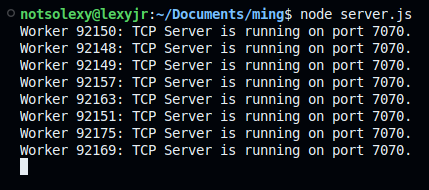
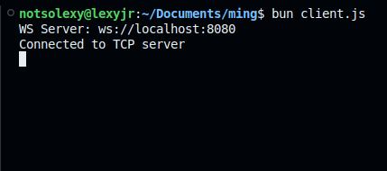

# ming 
Ming is a distributed cloud platform for hosting computational services. This contains the nightly builds and the tech is bleeding edge. 

### Getting Started:
I personally use Node.js on top of Bun.js for development though native components from Bun.js is not yet utilized so should work on Node.js too. 

```bash
bun install
```

## Server 
Clustered tcp server with endure performance.
```bash
node server.js
```

**Output**:


## Client: 
TCP Client and WS to connect with frontend applications.
Bun is must faster for Client.
```bash
bun client.js || node client.js
```

**Output**:


## Frontend
```bash
cd frontend && bun run dev
```